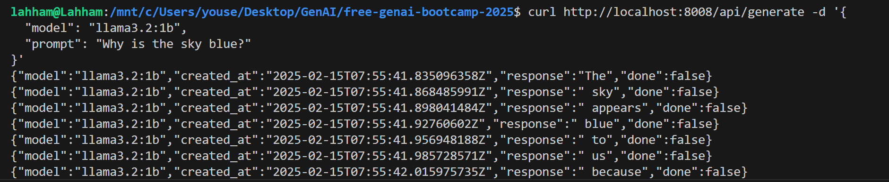
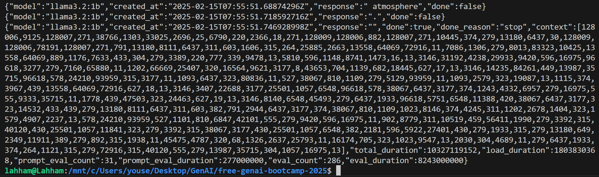

# Generative AI Components (GenAIComps)
this repository contains the code for the generative AI components (GenAIComps) project. The project aims to provide a set of components that can be used to build generative AI models. The components are designed to be modular and can be easily combined to build complex models.

## Key Features of GenAIComps
- Microservices: GenAIComps offers a suite of containerized microservices, each designed to perform specific functions within the application architecture. This modularity promotes flexibility and scalability, allowing developers to independently develop, deploy, and scale individual components.
- MegaService Composition: Utilizing a service composer, GenAIComps can assemble multiple microservices into a cohesive mega-service tailored for real-world enterprise AI applications. This orchestration enables the creation of end-to-end solutions by coordinating interactions between various microservices. 
- Gateway Integration: The platform provides a gateway that serves as the interface for users to access the mega-service. It supports API definition, versioning, rate limiting, and request transformation, offering fine-grained control over user interactions with the underlying microservices.

### to run docer without sudo
```bash
sudo groupadd docker
sudo usermod -aG docker $USER
newgrp docker
```

### to check if docker is running
```bash
docker run hello-world
```

### Running Ollama Third-Party Service

to choose the model check: https://Ollama.com/library

#### Gettinf the host IP
```sh
sudo apt-get install net-tools
ifconfig
```

#### Environment Variables
```sh
NO_PROXY=localhost LLM_ENDPOINT_PORT=8008 LLM_MODEL_ID="llama3.2:1b" host_ip=172.29.70.192 docker compose up
```

#### Ollama API
once the ollama server is runnnig we can make API calls to the ollama API

https://github.com/ollama/ollama/blob/main/docs/api.md

#### Download (Pull) The Model
```sh
curl http://localhost:8008/api/pull -d '{
  "model": "llama3.2:1b"
}'
```



#### Genearate a request
```sh
curl http://localhost:8008/api/generate -d '{
  "model": "llama3.2:1b",
  "prompt": "Why is the sky blue?"
}'
```



