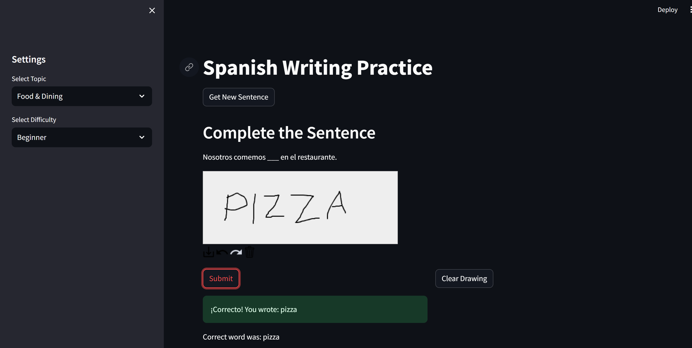

# Spanish Writing Practice App

An interactive Streamlit application for Spanish language learners to practice their writing skills using handwriting recognition.



## Features

- Topic-based Spanish sentence generation using AWS Bedrock Nova
- Multiple difficulty levels (Beginner, Intermediate, Advanced)
- Handwriting recognition using Microsoft's TrOCR
- Interactive drawing canvas
- Immediate feedback on submissions
- Fallback sentences when AWS is unavailable

## Setup

1. Install dependencies:
```bash
pip install -r requirements.txt
```

2. Configure AWS credentials:
   - Ensure you have AWS credentials configured with access to Bedrock
   - Set up your AWS credentials in `~/.aws/credentials` or use environment variables

3. Run the application:
```bash
streamlit run app.py
```

## Usage

1. Select a topic and difficulty level from the sidebar
2. Click "Get New Sentence" to generate a new incomplete Spanish sentence
3. Write the missing word in the drawing canvas
4. Click "Submit" to check your answer
5. Use "Clear Canvas" to try again or get a new sentence

## Topics

- Food & Dining
- Travel
- Family & Friends
- Daily Activities
- Nature & Environment

## Requirements

- Python 3.8+
- Streamlit
- AWS Bedrock access
- Internet connection for AWS services and model downloads
